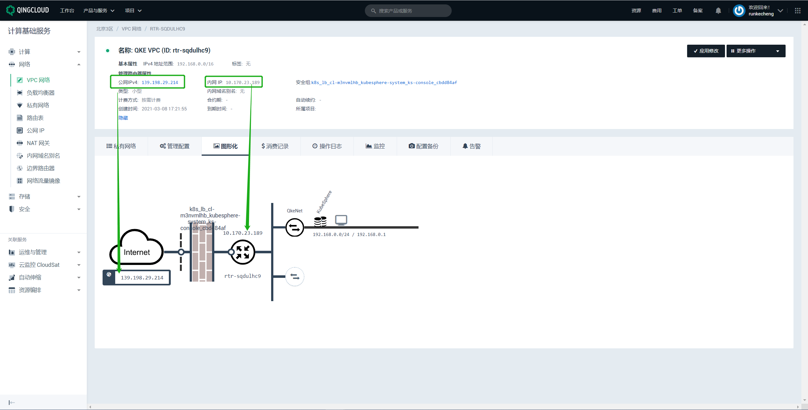
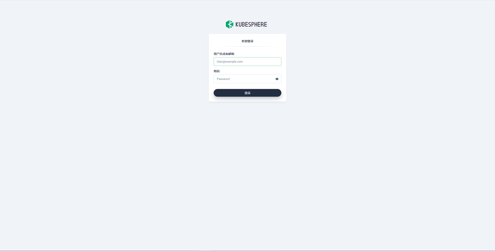

# 在青云公有云上部署 KubeSphere

## 部署准备

1. 创建一个安全组，参考下图放行端口。

   

2. 创建一个 VPC 网络，并绑定到安全组。

   

3. 申请一个公网 IP ，并绑定到 VPC 网络。

  

4. 创建私有网络。

  

5. 将私有网络加入到 VPC 网络中。

  

## 步骤一：在 AppCenter 部署

1. 新建 KubeSphere ，按需求选择配置参数，并绑定私有网络。

   

2. 勾选**OpenPitrix 应用商店**，开启应用商店。

> 说明: 开启 OpenPitrix 才可以使用上传应用模板的方式部署 Krypton。

  

3. 勾选确认用户协议，并点击提交。

  

4. 等待 KubeSphere 部署，部署成功后可在 **容器平台** > **容器引擎QKE** 中查看到集群信息。

  

5. 通过 VPC 的 **图形化** 功能可查看网络结构，正确结构应如下图所示。

## 步骤二：配置网络环境

以下以通过 VPC 转发方式配置访问 KubeSphere 为示例。

1. 配置目标集群网络参数。
   在**配置参数**中将**EIP 地址**设置为公网 IP 地址，**外网端口**设置为`16443`，单击**保存**，应用修改后的配置。

   > 说明：16443 为示例中配置的端口，也可根据实际需求改为其他端口。

   

2. 获取目标集群主节点 IP。

   

3. 修改 VPC 网络配置。
   进入 VPC 中修改如下图端口转发配置，其中转发的内网 IP 为主节点 IP。
   

4. 获取 **Kubeconfig** 配置信息。  
   如图，获取目标集群 **Kubeconfig** 配置信息。需确保 server 的值设置为 **VPC绑定的公网IP** : **VPC端口转发源端口**，如图示例中应为139.198.29.214:16443。

   

5. 新建并配置 **admin.conf**。
   如图，进入目标节点客户端。
   新建 **admin.conf** 文件，并将 **Kubeconfig** 中配置信息拷贝到 **admin.conf**。
   

## 访问 KubeSphere 控制台

访问 KubeSphere 控制台链接为: VPC绑定的公网 IP : 30880。

首次登录 KubeSphere 请使用如下默认管理员账户信息, 登录后务必及时修改密码！

|         用户名   |         密码         |
|---              |---                  |
|admin@kubesphere.io |P@88w0rd         |

