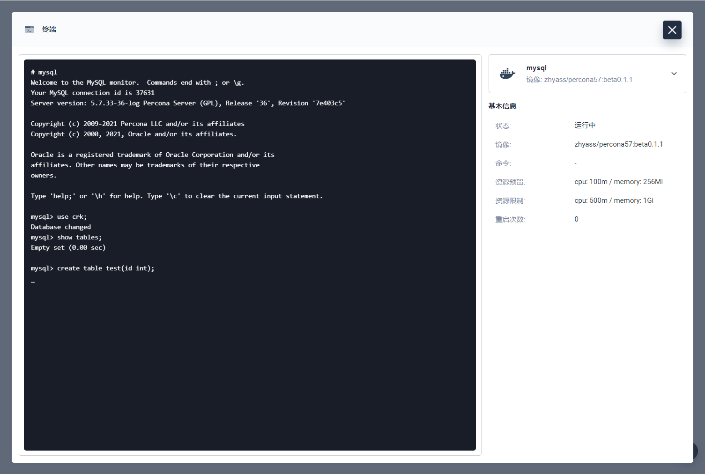
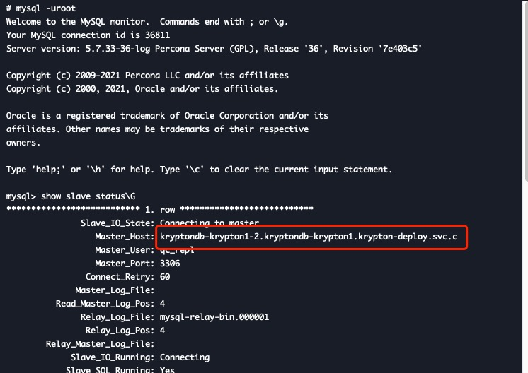
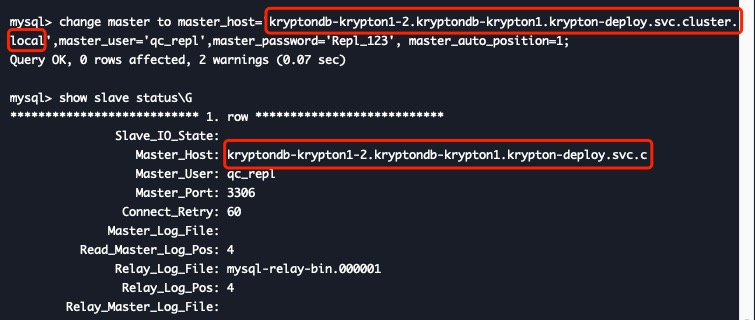

# **Krypton 故障排查记录**

## **[issue 1：主节点执行sql无响应](#主节点执行sql无响应)**  

## **主节点执行sql无响应**  

### **问题描述**  

连接至主节点后执行建库建表语句无响应，强制退出 MySQL 重新进入后发现语句已在主节点成功执行，从节点未同步。

### **部署环境**

上传模板至 KubeSphere 控制台部署。

### **部署参数**

默认。

### **其他配置**

项目名称为 `krypton-deploy`，release 名称为 `kryptondb`。

### **问题复现**  

### **问题排查**  

master_host 被截断，导致无法连接从节点。Krypton 使用半同步复制，主节点需要至少能与一个从节点连接。  

  

### **故障原因**  

master_host 过长被mysql截断，导致从节点连不上主节点。

### **解决方法**

控制 master_host 在 60 字节内。  
