# 2.1 测试

## 在 kubesphere 上部署集群  

详细部署步骤参考 [在 KubeSphere 上部署 Krypton 集群](https://github.com/runkecheng/deploy-doc/blob/master/%E5%9C%A8kubesphere%E4%B8%8A%E9%83%A8%E7%BD%B2krypton%E9%9B%86%E7%BE%A4.md)

结论：能够在 kubesphere 上成功部署集群。  

## 查看容器组、容器、服务等状态  

### 容器组

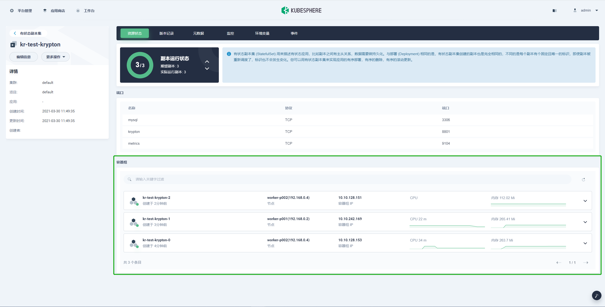

### 容器

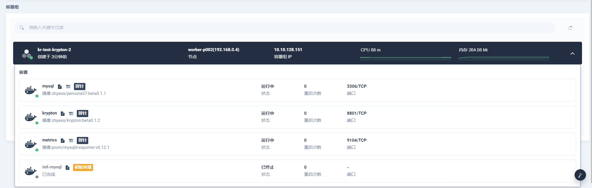

### 服务

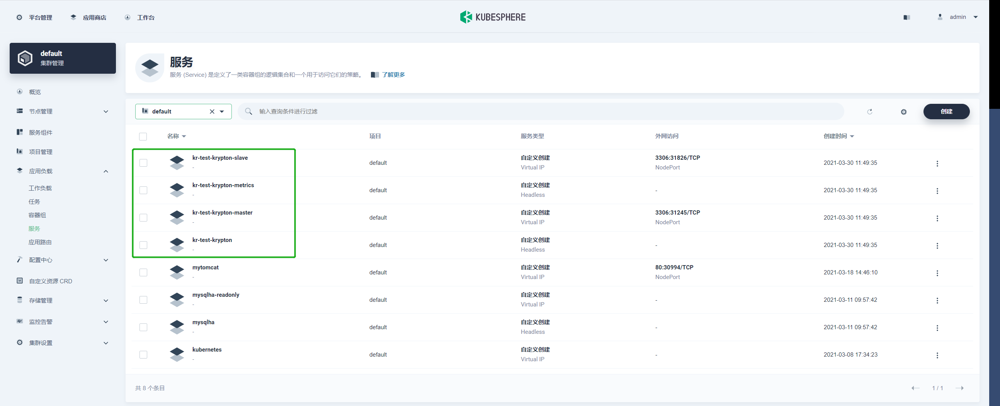

结论：容器组、容器、服务等状态正常，均成功创建并处于运行中，架构与预期一致。

## 创建和删除用户  

执行如下指令创建一个普通用户。

```bash
kubectl exec -ti <pod-name> -c krypton /krypton/kryptoncli mysql createuser <user> <host> <password> <YES/NO>
```

创建一个名为 `test` 的普通用户。  

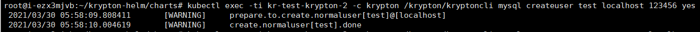

查看用户授权。

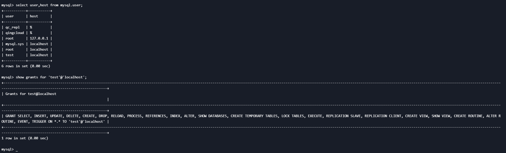

执行如下指令创建一个超级用户。

```bash
kubectl exec -ti <pod-name> -c krypton /krypton/kryptoncli mysql createsuperuser <user> <host> <password> <YES/NO>
```

创建一个名为 `testsuper` 的超级用户。  

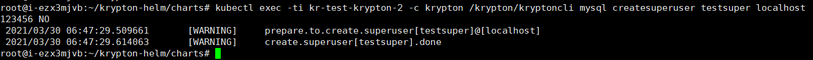

查看超级用户授权。

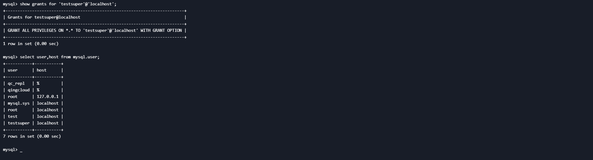

执行如下指令删除用户。

```bash
kubectl exec -ti <pod-name> -c krypton /krypton/kryptoncli mysql dropuser <user> <host>
```

删除 `test` 用户。


test 用户已经被成功删除。


结论：增加/删除用户均能够正常执行。

## 查看err、slow日志  

### err 日志

err 日志可在控制台容器日志查看

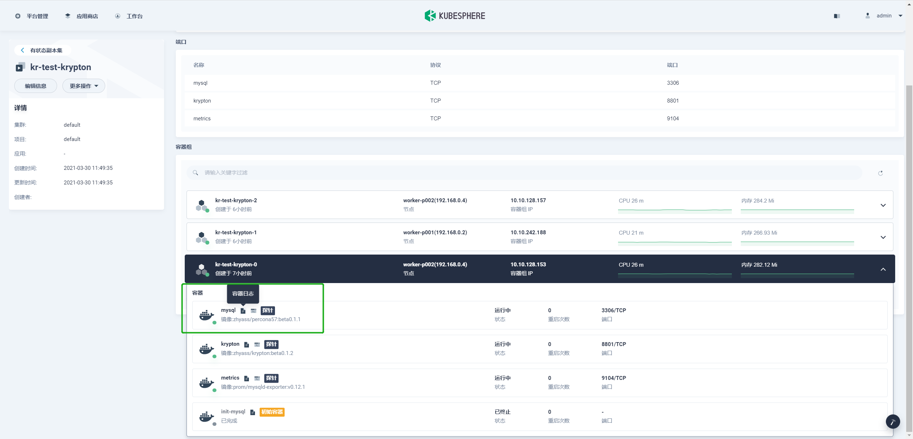

容器日志显示正常。

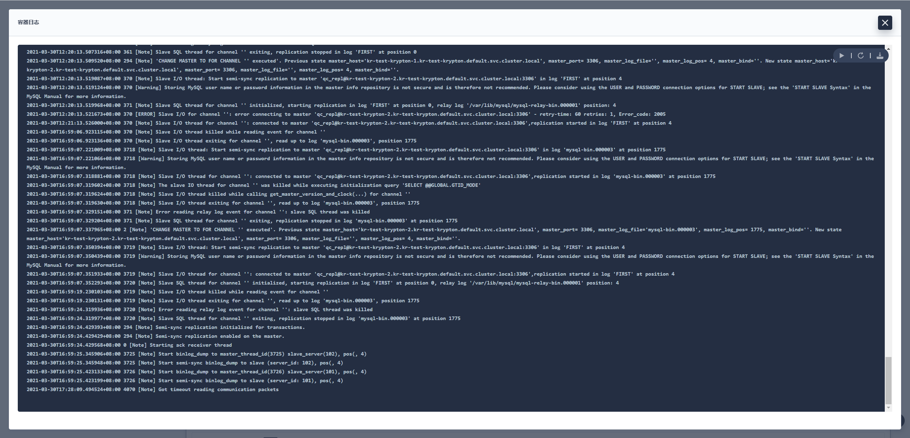

### slow日志

待更新。

## 增加或减少pod（注意pod数量应该为1、2、3、5、7等）  

增加 pod 数量到 5。

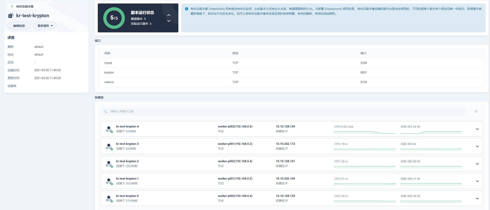

减少 pod 数量到 1。

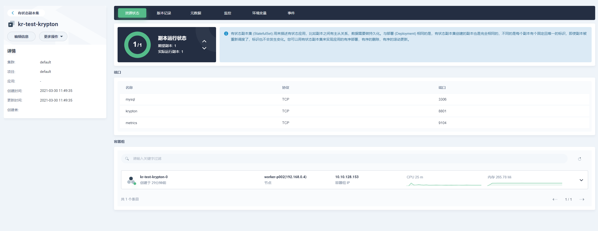

结论：添加或删除pod能够正常调度。

## 使用 service-master 和 service-slave 连接主从，测试读写  

查看 service-master 端口。

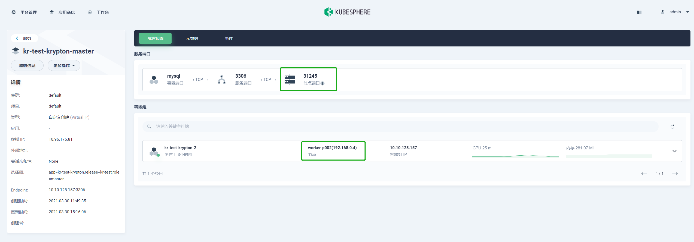

通过节点 IP 和 service-master 端口连接主节点。


测试主节点读写。


查看 service-slave 端口。

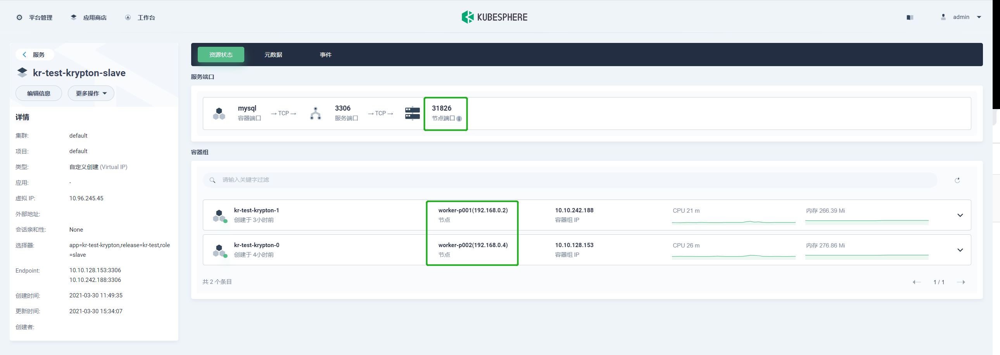

通过节点 IP 和 service-slave 端口连接从节点。


测试从节点读写。

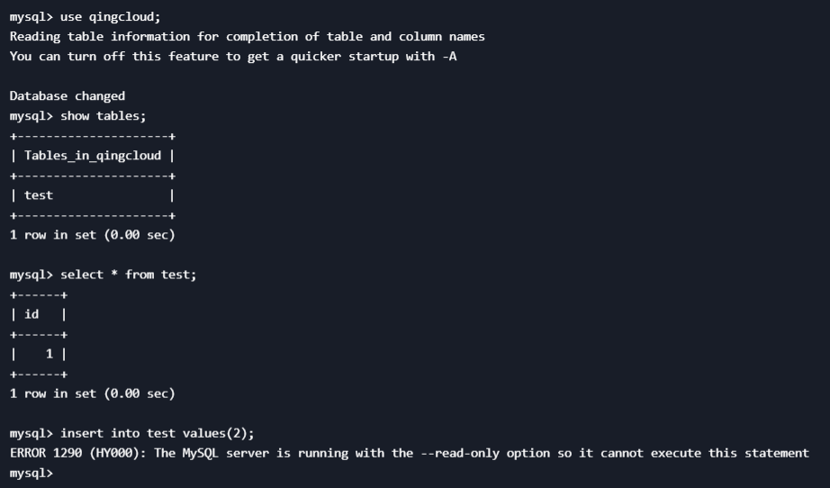

结论：主从节点均可以通过对应service暴露的端口连接。主节点读写正常，从节点为只读节点，符合设计。

## mysql配置参数修改  

待更新。

## 手动换主后，查看是否能成功选主，注意pod、service-master和service-slave的状态  

输入以下指令手动换主。

```bash
kubectl exec -ti <pod-name> -c krypton /krypton/kryptoncli raft trytoleader
```

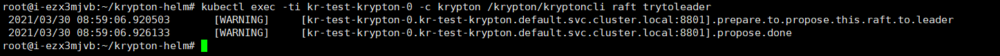

主节点切换成功。

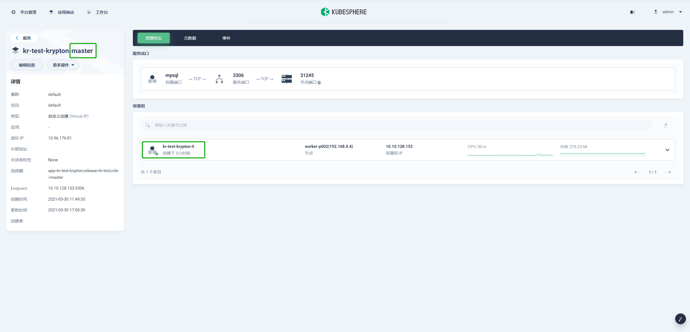

原主节点变为从节点。

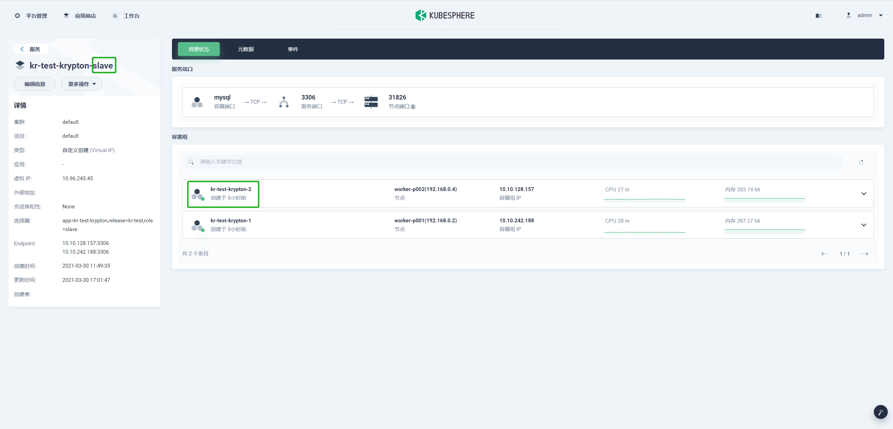

结论：手动切换主节点成功。  

## 总结

已测试功能均正常。

待测试点1:slow日志查看。

原因：操作未掌握。

待测试点2:mysql配置参数修改

原因：未明确需求。
