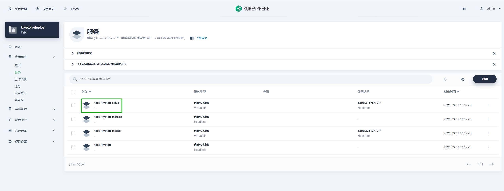
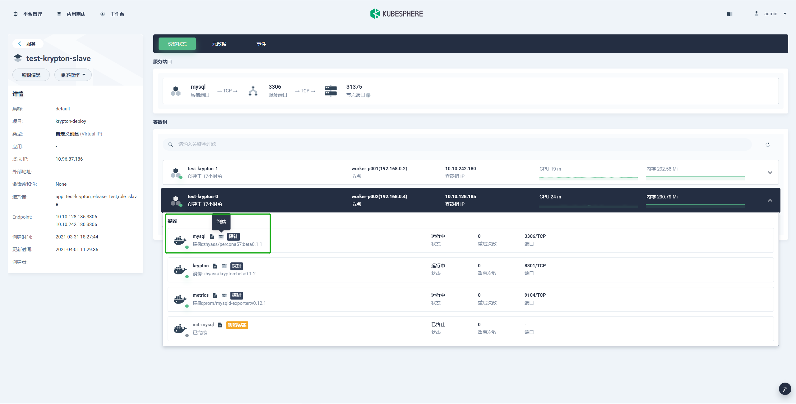
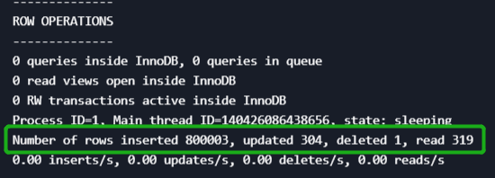
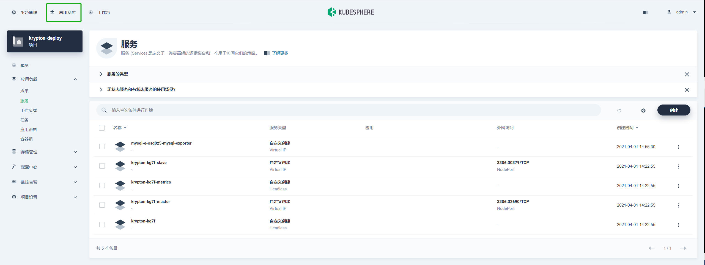
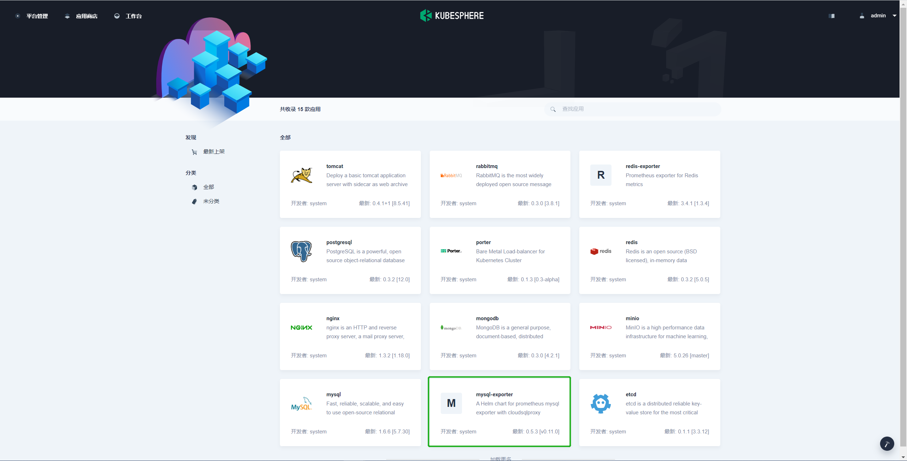
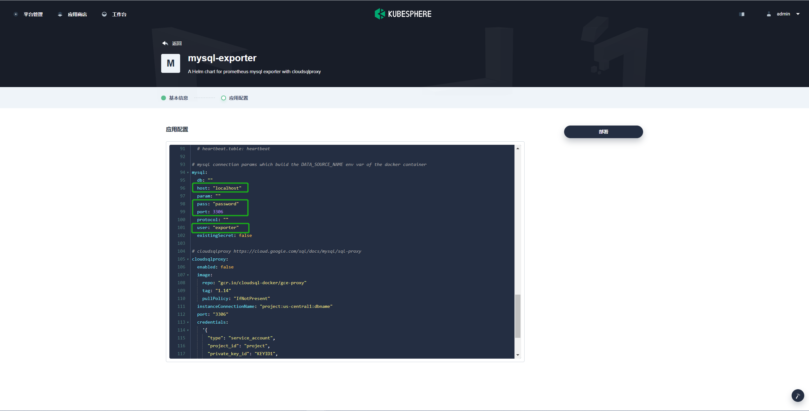
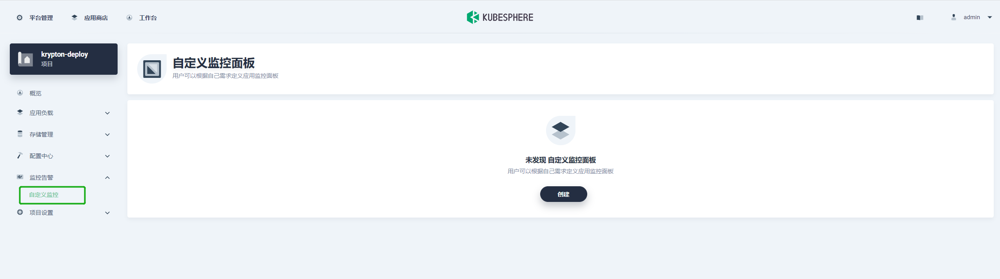
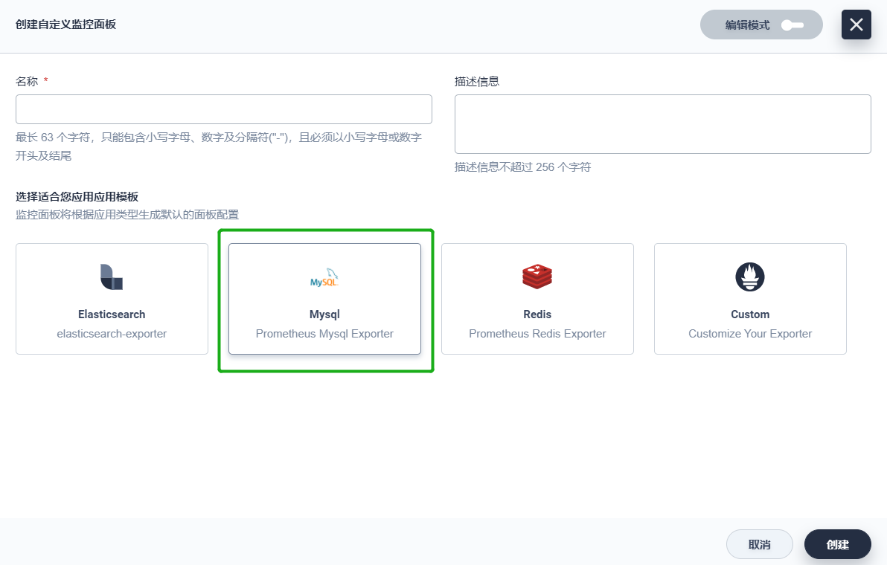
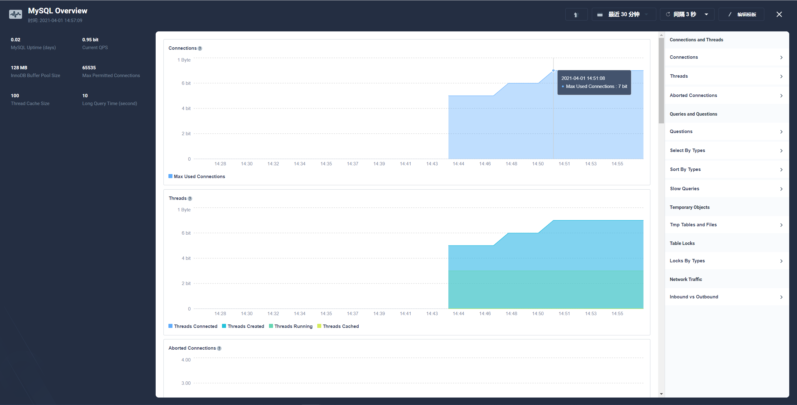
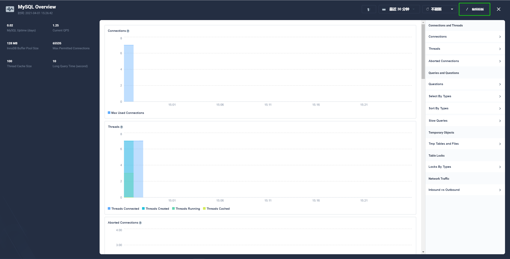

# 2.2 测试

## 1.service-slave分发连接均衡(负载均衡)

使用 sysbench 测试。

创建测试表。

```bash
sysbench --db-driver=mysql --mysql-user=<user-name> --mysql-password=<password> --mysql-host=<host> --mysql-port=<port> --mysql-db=<database> --range_size=100 --table_size=10000 --tables=2 --threads=64 --events=0 --time=60 --rand-type=uniform /usr/share/sysbench/oltp_read_only.lua prepare
```

执行测试。

```bash
sysbench --db-driver=mysql --mysql-user=<user-name> --mysql-password=<password> --mysql-host=<host> --mysql-port=<port> --mysql-db=<database> --range_size=100 --table_size=10000 --tables=2 --threads=64 --events=0 --time=60 --rand-type=uniform /usr/share/sysbench/oltp_read_only.lua run
```

在 **应用负载** 下的 **服务** 中查看从节点服务。



进入从节点服务，可以通过从节点下的 **终端** 打开对应从节点的终端。



连接 mysql，查看节点状态。

```bash
mysql
show engine innodb status\G
```

分别查看所有从节点状态。




### 结论

从节点 read 数目一致，实现了负载均衡。

## 2.通过kubesphere添加自定义监控模板，以及告警功能

### 前置准备

- 请确保已启用 OpenPitrix 系统。MySQL 和 MySQL 导出器将通过应用商店来部署。

- 创建 REPLICATION CLIENT 权限用户

### 测试步骤

选择页面左上角的 **应用商店**。



选择 **mysql-exporter**。



在配置界面更改以下内容。




> 说明：连接使用的用户需要拥有 SUPER 或 REPLICATION CLIENT 权限。

在项目管理界面，选择 **监控告警** > **自定义监控**。



单击 **创建** ，选择 **MySQL** 根据模板创建一个MySQL监控面板。



连接成功，可以看到实时监控数据。



可以通过右上角的 **编辑模板** 自定义监控参数。



### 结论

连接正常，可以使用自定义模板监控。

## 创建 REPLICATION CLIENT 权限用户

### 创建用户

```bash
CREATE USER 'user'@'%' IDENTIFIED BY 'password';
FLUSH PRIVILEGES;
```

### 授权

```bash
GRANT REPLICATION CLIENT ON *.* TO 'user'@'%' IDENTIFIED BY 'password';
GRANT REPLICATION SLAVE ON *.* TO 'user'@'%' IDENTIFIED BY 'password';
```
