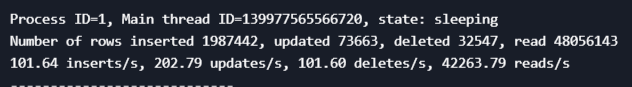
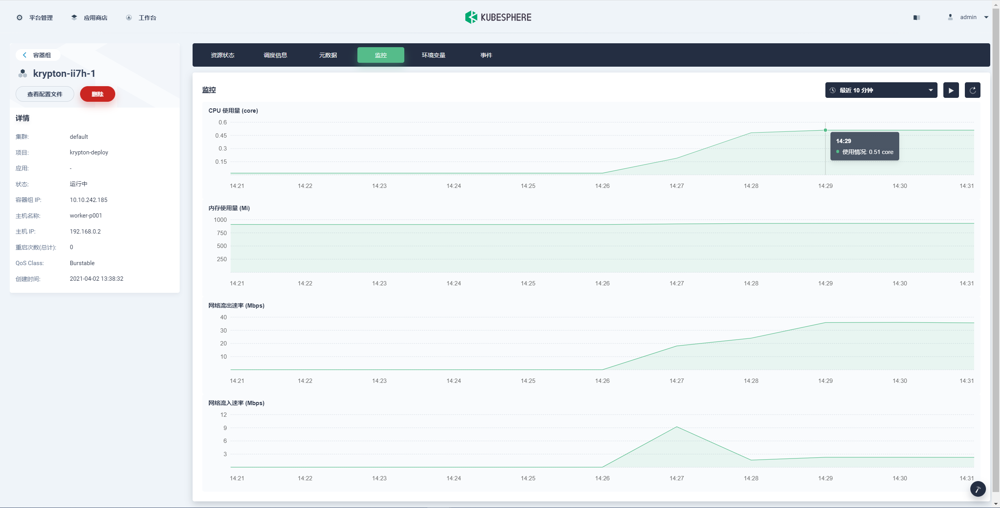
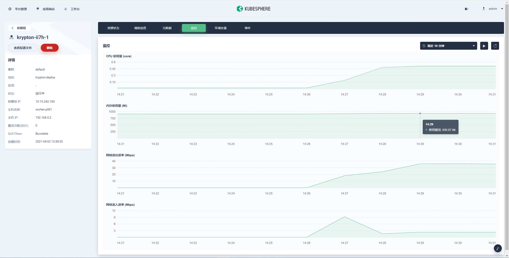
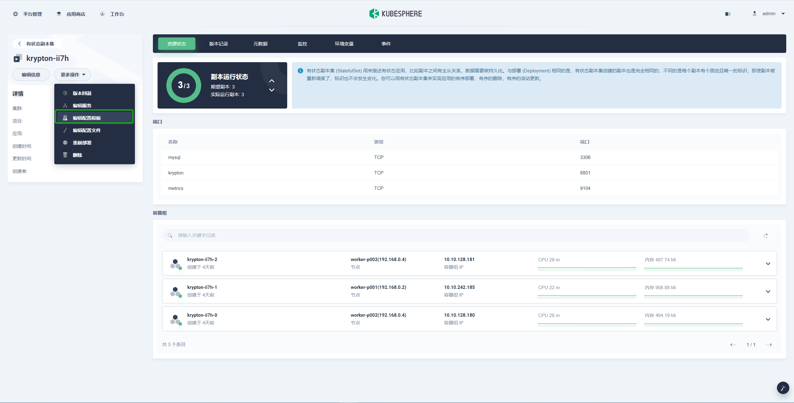
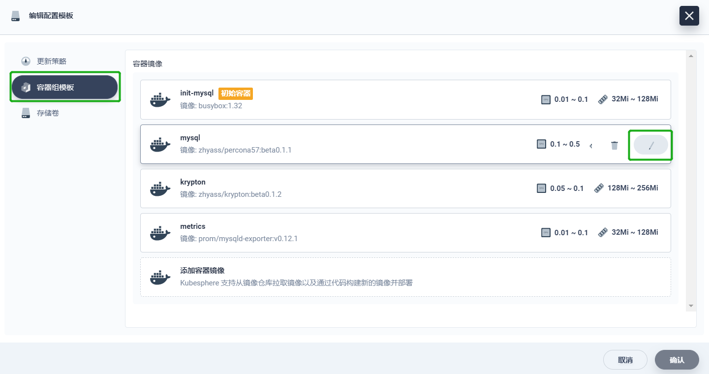
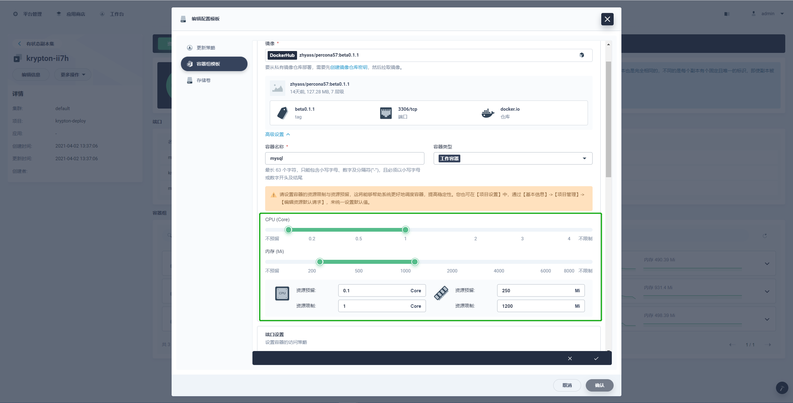
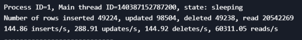
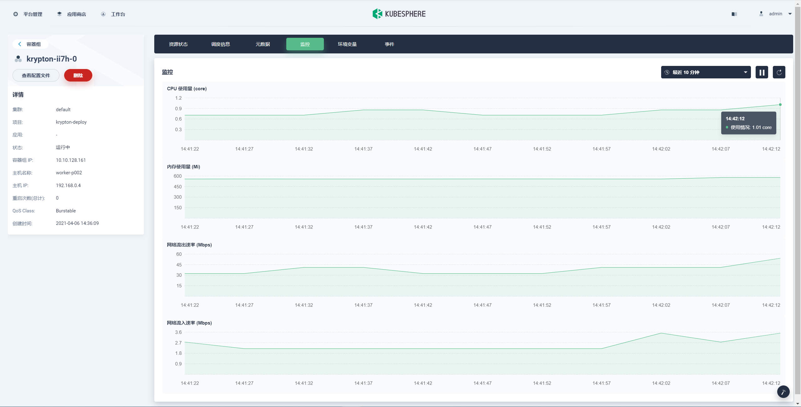
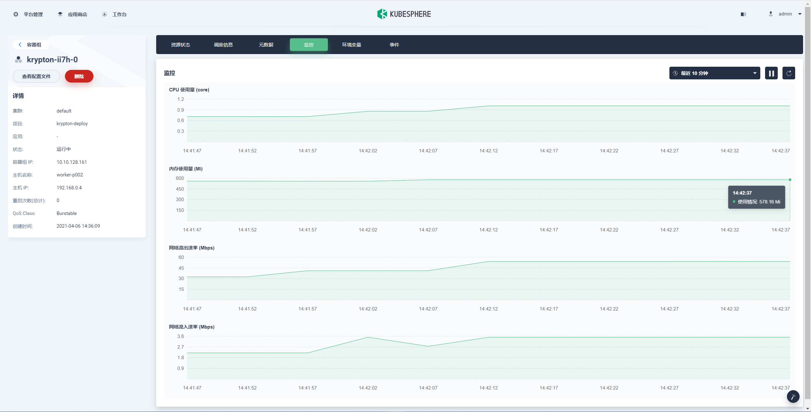

# 2.3 测试

## 压测

### 调整 mysql.resource

对原配额执行测试。

```bash
sysbench --db-driver=mysql --mysql-user=<user> --mysql-password=<password> --mysql-host=<host> --mysql-port=<port> --mysql-db=<database> --range_size=100 --table_size=100000 --tables=4 --threads=128 --events=0 --time=3600 --rand-type=uniform /usr/share/sysbench/oltp_read_write.lua run
```

进入 MySQL 查看详细数据。

```bash
show engine innodb status\G
```



查看 CPU 监控。



查看内存监控。



进入 krypton 的有状态副本集中，选择 **更多操作** > **编辑配置模板**。



单击 **容器组模板**，选择编辑 mysql 模板。



编辑资源配额，示例将 CPU 上限由 0.5 提升到 1，内存由 1000 提升到1200。



执行同样的测试，进入 MySQL 查看详细数据。



查看 CPU 监控。



查看内存监控。



可以看到在同样的测试条件下，增加配额后性能有一定提升，对资源的限制与设置的一致。

### 调整 pvc 的 storageclass
