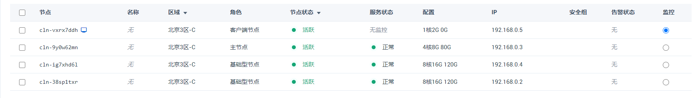
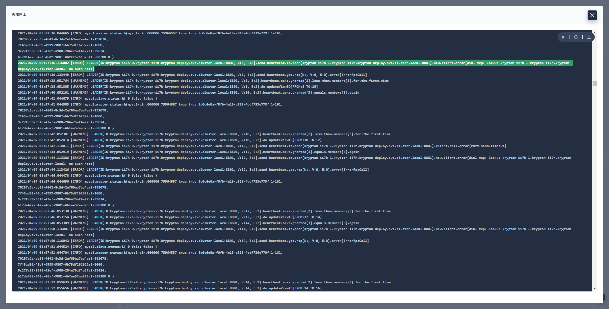
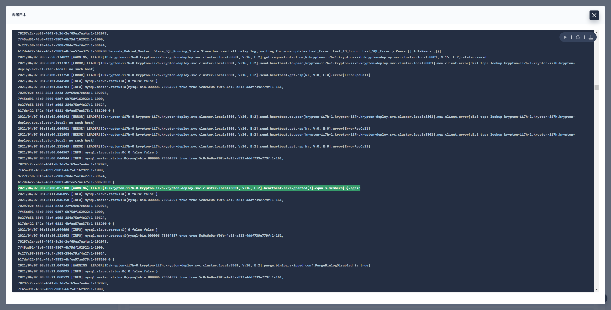
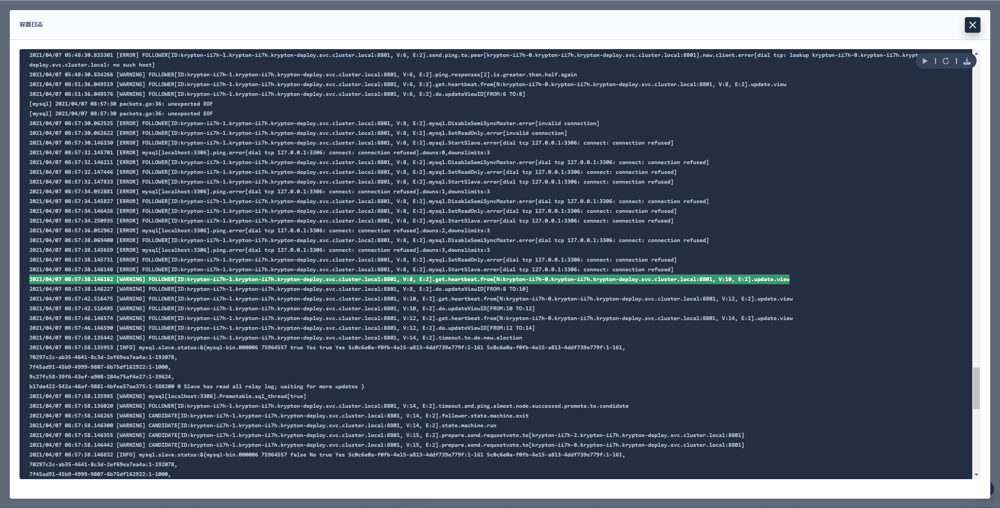

# Krypton异常(高可用)测试

## 测试环境

Krypton 以默认配置部署在 KuberSphere 上，KuberSphere 集群配置如下：



Krypton 主从关系如下：

master 节点 `krypton-ii7h-0` 及 master 服务。


两个 slave 节点 `krypton-ii7h-1`, `krypton-ii7h-2`及 slave 服务。


> 说明：以下所有测试用例在测试前都会恢复到原主从关系。

## Follower pod MySQL容器故障

使用 sysbench 对子节点 `krypton-ii7h-1` 进行只读测试。

```bash
sysbench --db-driver=mysql --mysql-user=qingcloud --mysql-password=Qing@123 --mysql-host=192.168.0.2 --mysql-port=30740 --mysql-db=qingcloud --range_size=100 --table_size=100000 --tables=4 --threads=128 --events=0 --time=3600 --rand-type=uniform /usr/share/sysbench/oltp_read_only.lua <prepare/run/cleanup>
```

进入子节点 `krypton-ii7h-1`，kill MySQL容器。

```bash
kill <mysql_pid>
```

容器自动重启中。


查看主节点 krypton 日志，和 `krypton-ii7h-1` 断开连接。



查看从节点 `krypton-ii7h-1` 的 krypton 日志，连接不到 MySQL。


重启完成后，主节点成功重连从节点。



从节点 `krypton-ii7h-1` 重新加入集群，主节点仍然为 `krypton-ii7h-0`。



## Leader pod MySQL容器故障


## 测试结果汇总
  
| 用例                                  | 结论                                              |
| -----------                           | -----------                                        |
| Follower pod MySQL容器故障            | 故障从节点pod重启，重启后重新加入集群，主从结构未改变                                                                                          |
| Leader pod MySQL容器故障              | 主节点pod重启，重启时从节点重新选主，原主节点重启完成后加入集群成为从节点                                                   |