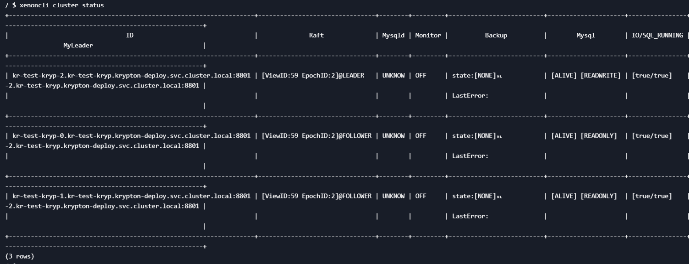
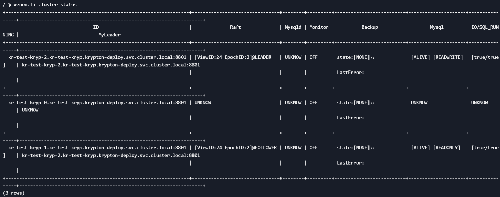
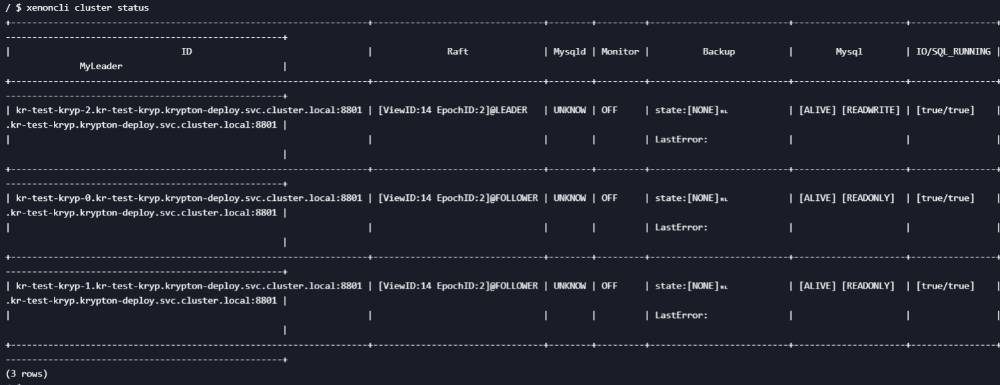

# Krypton异常(高可用)测试

## 测试结果汇总
  
| 用例                           |   负载       | 结论                                                                      |
| -----------                    | ----        | -----------                                                               |
| Follower pod MySQL容器故障     |  主节点读写   | 故障从节点MySQL容器重启，重启后重新加入集群，主从结构未改变                   |
| Leader pod MySQL容器故障       |   主节点读写   | 主节点MySQL容器重启，重新选主 |
| Follower pod xenon 故障        |  主节点只读  | 故障从节点xenon容器重启，重启后重新加入集群，主从结构未改变                    |
| Follower pod xenon 故障        |  主节点读写  |   故障从节点xenon容器重启，重新选主                                                                      |
| Leader pod xenon 容器故障      |      主节点读写        |       主节点xenon容器重启，重新选主                                                                     |

## 测试环境

Krypton 以默认配置部署在 KuberSphere 上，KuberSphere 集群配置如下：


Krypton 主从关系如下：

master 节点 `kr-test-kryp-2` 及 master 服务。


两个 slave 节点 `kr-test-kryp-0`, `kr-test-kryp-1`及 slave 服务。


> 说明：以下所有测试用例在测试前都会恢复到原主从关系。

## 测试方法示例 Follower pod MySQL容器故障

使用 sysbench 对主节点 `kr-test-kryp-2` 进行读写测试。

```bash
sysbench --db-driver=mysql --mysql-user=qingcloud --mysql-password=Qing@123 --mysql-host=<host> --mysql-port=<port> --mysql-db=qingcloud --range_size=100 --table_size=100000 --tables=4 --threads=128 --events=0 --time=3600 --rand-type=uniform /usr/share/sysbench/oltp_read_write.lua <prepare/run/cleanup>
```

> 说明：从节点为只读节点，准备数据阶段应在主节点执行，主节点会将数据同步到从节点。

进入从节点 `kr-test-kryp-0` 的 MySQL 容器，kill MySQL 进程。

```bash
kill 1
```

MySQL 进程被kill后，MySQL 容器会自动重启。


查看主节点 krypton 日志，已与从节点 `kr-test-kryp-0` 断开连接。

```bash
2021/04/08 06:31:20.469387 trace.go:37: [ERROR] LEADER[ID:kr-test-kryp-2.kr-test-kryp.krypton-deploy.svc.cluster.local:8801, V:51, E:2].send.heartbeat.to.peer[kr-test-kryp-0.kr-test-kryp.krypton-deploy.svc.cluster.local:8801].new.client.error[dial tcp: lookup kr-test-kryp-0.kr-test-kryp.krypton-deploy.svc.cluster.local: no such host]
```

查看从节点 `kr-test-kryp-0` 的 krypton 日志，连接不到 MySQL。

```bash
2021/04/08 06:30:58.512755 trace.go:37: [ERROR] FOLLOWER[ID:kr-test-kryp-0.kr-test-kryp.krypton-deploy.svc.cluster.local:8801, V:49, E:2].mysql.DisableSemiSyncMaster.error[invalid connection]

2021/04/08 06:30:58.513041 trace.go:37: [ERROR] FOLLOWER[ID:kr-test-kryp-0.kr-test-kryp.krypton-deploy.svc.cluster.local:8801, V:49, E:2].mysql.SetReadOnly.error[invalid connection]

[mysql] 2021/04/08 06:30:58 packets.go:36: unexpected EOF

2021/04/08 06:30:58.517254 trace.go:37: [ERROR] FOLLOWER[ID:kr-test-kryp-0.kr-test-kryp.krypton-deploy.svc.cluster.local:8801, V:49, E:2].mysql.StartSlave.error[dial tcp 127.0.0.1:3306: connect: connection refused]

2021/04/08 06:31:00.215909 mysql.go:95: [ERROR] mysql[localhost:3306].ping.error[dial tcp 127.0.0.1:3306: connect: connection refused].downs:0,downslimits:3
```

重启完成后，主节点成功重连从节点。

```bash
2021/04/08 06:31:56.471387 trace.go:32: [WARNING] LEADER[ID:kr-test-kryp-2.kr-test-kryp.krypton-deploy.svc.cluster.local:8801, V:53, E:2].heartbeat.acks.granted[3].equals.members[3].again

2021/04/08 06:32:00.845461 api.go:280: [INFO] mysql.slave.status:&{ 0 false false }

2021/04/08 06:32:00.945841 api.go:290: [INFO] mysql.master.status:&{mysql-bin.000004 381772627 true true 37f1ae89-b911-4eb3-8a22-275f255f20a0:1-93762,

77b1bbdf-d4c8-49a4-97af-8e773a145cbb:1-1219862 0 }
```

进入主节点 xenon 容器，使用如下指令查看集群状态。

```bash
xenoncli cluster status
```

从节点 `kr-test-kryp-0` 已重新加入集群，主节点仍然为 `kr-test-kryp-2`。



## Leader pod MySQL容器故障

## Follower pod xenon 故障

使用 sysbench 对主节点 `kr-test-kryp-2` 进行只写测试。

```bash
sysbench --db-driver=mysql --mysql-user=qingcloud --mysql-password=Qing@123 --mysql-host=<host> --mysql-port=<pod> --mysql-db=qingcloud --range_size=100 --table_size=100000 --tables=4 --threads=128 --events=0 --time=3600 --rand-type=uniform /usr/share/sysbench/oltp_write_only.lua <prepare/run/cleanup>
```

进入 xenon 容器，kill xenon进程。

```bash
kill 1
```

容器自动重启。

查看主节点 xenon 日志，主节点与从节点 `kr-test-kryp-0` 断开连接。

```bash
2021/04/08 08:17:26.306673 trace.go:37: [ERROR] LEADER[ID:kr-test-kryp-2.kr-test-kryp.krypton-deploy.svc.cluster.local:8801, V:4, E:2].send.heartbeat.to.peer[kr-test-kryp-0.kr-test-kryp.krypton-deploy.svc.cluster.local:8801].new.client.error[dial tcp 10.10.128.171:8801: connect: connection refused]
```

进入主节点 xenon 容器，使用如下指令查看集群状态，此时 `kr-test-kryp-0` 与其他节点处于断开连接状态。

```bash
xenoncli cluster status
```



从节点 xenon 容器重启成功后，再次进入主节点 xenon 容器，查看集群状态，可见从节点 `kr-test-kryp-0` 已重新加入集群，主从结构未改变。



